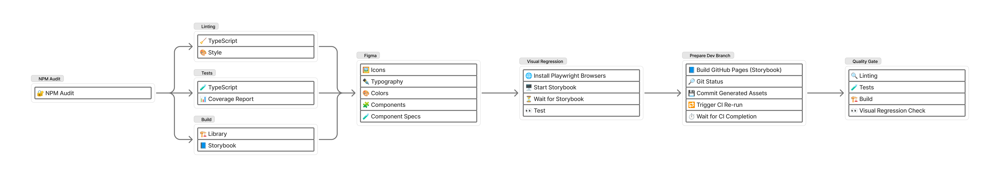

# @amiral-corelab/acl

`@amiral-corelab/acl` is a laboratory-oriented Angular library.

The design system is fully handcrafted and built with APCA contrast guidelines in mind.

No external framework is used, nor will it be used.

## 📚 Storybook

The component library is documented and previewable in Storybook:

👉 **https://amiral-corelab.github.io/acl**

## 🧱 Scope

For now, the focus is on designing and adding UI components.

No versioning is planned at this time.

## CI/CD

### Dev Pull Request

